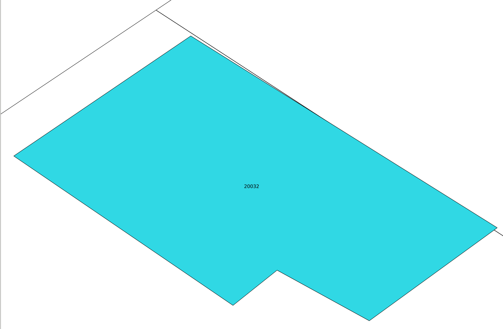
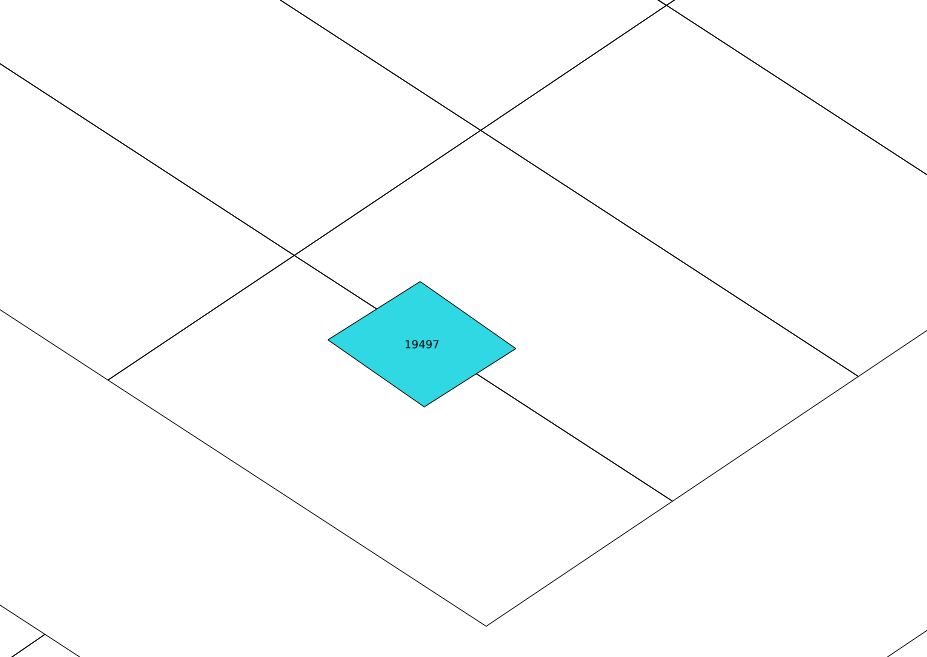

# Bellingham-Bldg-Addr
*Not ready for import*

#### Building and Address Import
This project will import data from the City of [Bellingham](cob.org), WA. Bellingham provides a wide array of data from their website, including docks, sidewalks, trees, fire hydrants, roads, and of course addresses and building outlines. Please feel free to offer suggestions and PR to improve the process.

The import process will use the US Tasking Manager. Bellingham precincts will be used to break the import into 67 small tasks.

#### License
The City of Bellingham offer open data with no strings attached.

#### Process
This process is built on using PostGIS and Python. It has been developed using Fedora 24. It should work on MacOS.
Steps to build .osm import files
-  Download [Planning](http://www.cob.org/data/gis/SHP_Files/COB_plan_shps.zip) shapefiles from Bellingham GIS.
- Download [Landbase](http://www.cob.org/data/gis/SHP_Files/COB_land_shps.zip) shapefiles from Bellingham GIS
- Download [Structures](http://www.cob.org/data/gis/SHP_Files/COB_struc_shps.zip) shapefiles from Bellingham GIS
- Download [Transporation](http://www.cob.org/data/gis/SHP_Files/COB_tran_shps.zip) shapefiles from Bellingham GIS
-  unzip the shapefiles
- run import.sh to build the Postgresql tables
- run bellingham_osm.sh to build individual .osm files for import

#### Requirements
* PostGIS
* Python
* Postgresql functions from my [sql](https://github/cliffordsnow/sql) repository
```
expand_directions.sql
expand_roads.sql
format_roads.sql
fullname.sql
```

#### Whatcom Roads
Whatcom roads are available as a background layer. The WMS service can be loaded in JOSM using the images preferences with the following url
```
http://67.160.74.76/geoserver/wms?service=WMS&request=GetMap&styles=&TRANSPARENT=TRUE&bbox=-1.37021663844817E7,6214544.26722411,-1.35320129795646E7,6275268.80055685&width=768&height=330
```
2.  Press Get Layers, select Whatcom Roads and  
3.  Change the image type to png
4.  Name the layer Whatcom Roads

#### Notes
This is my first attempt using parcel data to help identify address nodes to building outlines. One of the problems that needed to be overcome was buildings that covered more than one parcel. In some cases it appeared that either the building outline was shifted or that the parcel outline was incorrect.



Below is an example of a building in the middle of two parcels



Query to select the correct parcel. The percentage, I used 80% seem right for this use.

```
UPDATE bellingham_bldg SET parcel_cod = b.gid
FROM bellingham_parcels p join bellingham_bldg b ON ST_INTERSECTS(b.geom,p.geom)
WHERE b.parcel_cod IS NULL AND ST_AREA(ST_INTERSECTION(p.geom, b.geom)::geometry)/ST_AREA(b.geom::geometry) > .8;
```
